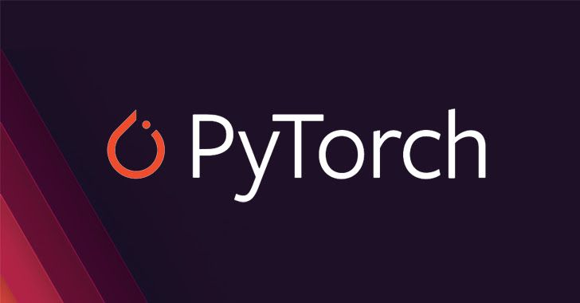

# 🔥 PyTorch From Zero to Hero

  

A structured log of my journey into Deep Learning and Computer Vision. Progressing step-by-step from fundamental architectures to advanced models.

## 📊 Lab Projects & Progress

| Project Name | Architecture | Status |
| :--- | :--- | :---: |
| **01 MNIST Digit Classification** | Linear Model (ANN) | 🟢 Completed |
| **02 MNIST Digit Recognition** | Convolutional Network (CNN) | 🟢 Completed |
| **03 Medical Cost Prediction** | Linear Model (MLP) | 🟢 Completed |
| **04 Cats vs Dogs Image Classifier** | Transfer Learning (ResNet18) | 🟢 Completed |
| **05 Pneumonia X-Ray Detection** | Transfer Learning (ResNet18) | 🟢 Completed |
| **06 Brain Tumor Detection (MRI)** | Transfer Learning (ResNet34) | 🟡 In Progress |

## 🛠️ Tech Stack & Tools

  &nbsp;&nbsp;&nbsp;&nbsp;&nbsp;&nbsp;&nbsp;&nbsp;
  &nbsp;&nbsp;&nbsp;&nbsp;&nbsp;&nbsp;&nbsp;&nbsp;
  

## 📂 Structure
- Each project subfolder contains the implementation training notebook (`.ipynb`) and its standalone logic.
- 📦 **Model Weights:** All trained model weights (`.pth`) are stored permanently and can be downloaded from the [Releases Section](https://github.com/mohammedmegahed2010-del/PyTorch-From-Zero/releases/tag/v1.0).

## 📝 Projects Breakdown & Details

### 01. MNIST Digit Classification 🔢

  

* **Description:** An introductory project to get familiar with PyTorch tensors, datasets, and foundational neural network concepts.
* **Dataset:** Loaded built-in via `torchvision.datasets.MNIST`.
* **Focus:** Learning basic forward propagation, loss functions, and optimization from scratch.

#### 02. Digit Recognition (CNN)

  

* **Description:** Transitioning from linear models to computer vision architectures to improve image recognition.
* **Architecture:** Custom Convolutional Neural Network (CNN).
* **Focus:** Understanding convolutional layers, pooling, and feature extraction.

#### 03. Medical Cost Prediction
* **Description:** A regression task aimed at predicting insurance medical costs based on tabular patient data.
* **Architecture:** Multi-Layer Perceptron (MLP).
* **Focus:** Handling continuous data, preprocessing tabular inputs, and evaluating regression metrics.

#### 04. Cats vs Dogs Image Classifier
* **Description:** A classic computer vision challenge to classify binary image datasets.
* **Architecture:** Transfer Learning with a pre-trained ResNet-18 baseline.
* **Focus:** Learning how to freeze early layers and modify the classification head for new visual tasks.

#### 05. Pneumonia X-Ray Detection
* **Description:** An advanced medical imaging application to detect pneumonia signs from chest X-Ray photos.
* **Architecture:** Fine-tuned Transfer Learning (ResNet-18).
* **Dataset:** Sourced from Kaggle medical chest X-Ray dataset (referenced in notebook comments).
* **Focus:** Applying deep learning skills to real-world clinical data and saving deployment-ready weights (`.pth`).
* **Metrics:** 83.20%

#### 06. Brain Tumor Detection (MRI)
* **Description:** A multi-class medical imaging application to classify brain MRI scans into four distinct categories (Healthy vs. 3 Tumor types).
* **Architecture:** Custom CNN / ResNet-34.
* **Focus:** Moving from binary to multi-class classification, handling grayscale MRI inputs, and preventing overfitting using advanced data augmentation.
